**Hi class! Welcome to the AOS C111/204 final project!** 

This project uses supervised machine learning models—Logistic Regression, MLP, and Decision Tree—along with SMOTE resampling to predict water potability from chemical and physical water-quality features.

## Introduction

Access to safe drinking water is a critical global environmental and public health priority. Even though issues like air quality and climate change often receive more attention, poor water quality can lead to serious health risks, making reliable assessment essential. The problem addressed in this project is determining whether a given water sample is potable (safe to drink) based solely on its measurable chemical and physical characteristics.

To study this problem, I used the Water Potability Dataset (Aditya Kadiwal, 2021) from Kaggle, which contains more than 3,000 water quality records with nine measured features, such as pH, hardness, sulfate concentration, and turbidity. The dataset includes a binary target variable indicating whether each sample is potable, making it well-suited for a supervised machine learning classification approach.

Because the dataset is highly imbalanced—with far fewer potable samples than non-potable ones—I applied SMOTE (Synthetic Minority Oversampling Technique) to create a more balanced training set. This allows models to better recognize the minority class and avoids the common issue of predicting only the majority category.

To solve the classification problem, I trained and compared three different supervised ML algorithms:

* Logistic Regression – an interpretable baseline that predicts class probabilities.

* Decision Tree Classifier – a nonlinear model capable of capturing feature interactions.

* MLPClassifier (Neural Network) – a more flexible model using a sigmoid activation function.

By evaluating each model using accuracy, precision, recall, F1-score, confusion matrices, and ROC curves, I found that the decision tree with SMOTE-balanced data provided the strongest overall performance for identifying potable water samples.

In the following sections, I describe the data, methods, analysis, and results in detail.

## Initial Interpretation of the Raw Data + Visualizations: 

### Plots

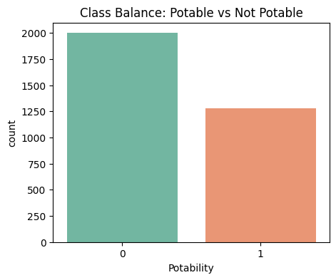
Figure 1: Class Balance (Potability Countplot)
 This plot shows the distribution of potable (1) versus non-potable (0) water samples. We can see that the dataset is imbalanced, with significantly more non-potable samples than potable ones. This imbalance is important to note as it can affect model training and evaluation.

  

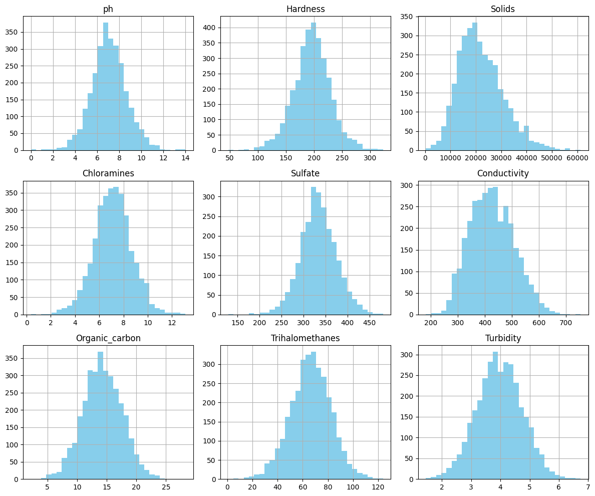
Figure 2: Feature Distribution (Histograms)
 These histograms illustrate the distribution of each individual feature. Most features appear to have a somewhat normal distribution, but some, like 'Solids' and 'Sulfate', show a slight skew. Features like 'pH' and 'Trihalomethanes' exhibit a wider spread. Understanding these distributions helps in identifying potential outliers and informing preprocessing steps, such as imputation or scaling.

  

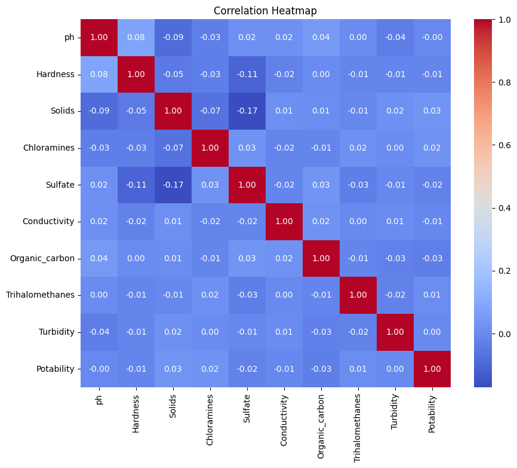
Figure 3: Correlation Heatmap:
 This heatmap displays the correlation coefficients between all features, including 'Potability'. Darker colors indicate stronger correlations. We can observe relationships between features; for example, 'Sulfate' and 'pH' show some correlation, and 'Hardness' and 'Solids' might also have moderate relationships. Importantly, the correlations with 'Potability' itself appear relatively low, suggesting that no single feature strongly predicts potability in a linear fashion. This might indicate that a more complex model or feature engineering could be beneficial.

  

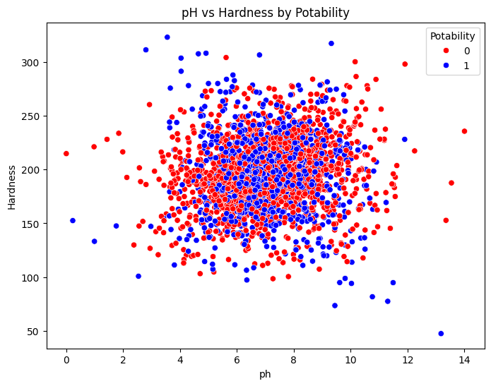
Figure 4: Scatter Plot (pH vs. Hardness by Potability)
 This scatter plot visualizes the relationship between 'pH' and 'Hardness', with points colored according to 'Potability'. It helps to see if there are clear clusters or patterns that differentiate potable from non-potable water based on these two features. From the plot, there doesn't seem to be a very distinct separation, indicating that these two features alone might not be sufficient to perfectly classify potability, and there's a good deal of overlap between the two classes.

  

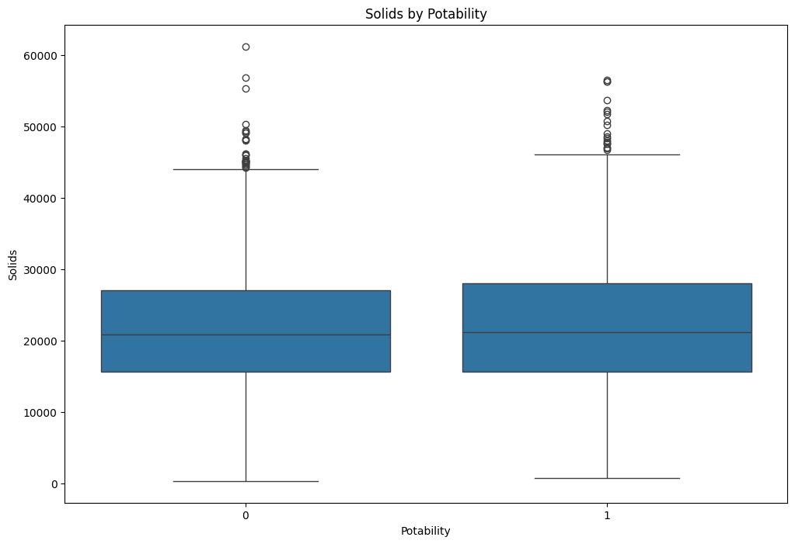
Figure 5: Boxplot (Solids by Potability)
 This boxplot compares the distribution of 'Solids' content for potable and non-potable water. It shows the median, quartiles, and potential outliers. We can see if there's a significant difference in the range or central tendency of 'Solids' between the two groups. In this case, the 'Solids' distribution for potable and non-potable water appears to be quite similar, with overlapping interquartile ranges, suggesting 'Solids' might not be a strong discriminator on its own.

### Interpretation
Overall, the EDA reveals an imbalanced dataset and indicates that potability is likely a complex classification problem, as no single feature stands out as a strong predictor. The presence of missing values-- evident as seen earlier-- and potentially overlapping feature distributions between classes highlight the need for careful data cleaning, preprocessing, and the use of robust classification models.

### Preprocessing/Missing Values
To prepare the dataset for modeling, two key preprocessing steps were performed. First, the variables pH, Sulfate, and Trihalomethanes contained missing values, so the median of each feature was used for imputation. Median filling is a simple but robust approach that avoids distortions caused by outliers. After imputation, the dataset contained no remaining missing values, ensuring that all models could be trained cleanly.

Next, all input features were normalized using MinMaxScaler, which rescales each feature into the range [0,1]. This step is especially important for algorithms like logistic regression and neural networks, which are sensitive to differences in feature scales. Normalizing the data ensures that no single feature dominates the learning process and improves model stability and convergence.

## Model
Here are some more details about the machine learning approach used in this project, and why these methods were appropriate for the dataset.

The goal of this work is to build a model that can classify whether a water sample is potable (1) or not potable (0) based on chemical and physical water-quality features. Because this is a supervised classification problem, I applied several classification algorithms—Logistic Regression, a Neural Network (MLPClassifier), and a Decision Tree Classifier—to learn patterns in the data and predict the potability label.

One of the biggest challenges in this dataset is class imbalance: most water samples are not potable. To address this, I used SMOTE (Synthetic Minority Oversampling Technique), which creates synthetic examples of the minority class during training so the models can better learn its characteristics.

My modelling pipeline follows the standard supervised-learning framework:

1. Preprocess the data (impute missing values, normalize features).

2. Split into training and testing sets.

3. Apply SMOTE to balance the training labels.

4. Train multiple classification models.

5. Evaluate each model using accuracy, precision, recall, F1-score, and confusion matrices.

6. Compare performance to determine the most effective model.

Below is an example of the modelling code used to train one of the classifiers (Decision Tree + SMOTE):
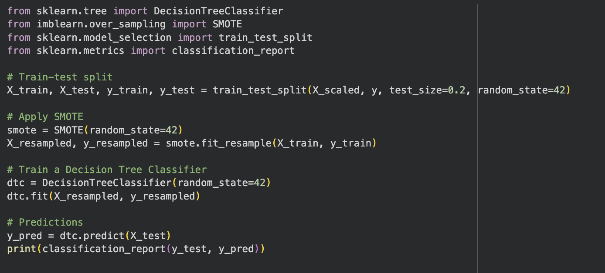
 Figure 6: Example code (not actually how it is integrated in project code)

## Results
### Confusion Matrix + ROC Curves

#### Original Logistic Regression
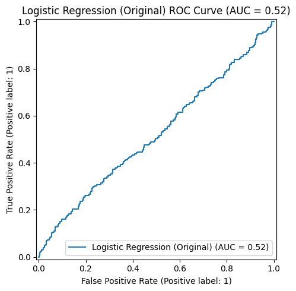
Figure 7: ROC curve for the original Logistic Regression model, showing an AUC of 0.52
 This score is only slightly above random guessing (AUC = 0.50), reflecting the model’s inability to distinguish between potable and non-potable water before applying SMOTE or other imbalance-handling techniques.

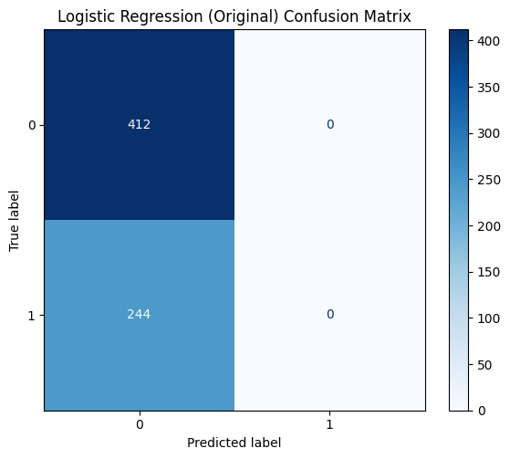
Figure 8: Confusion matrix for the original Logistic Regression model (before handling class imbalance)
 The model predicts every sample as “not potable” (class 0), resulting in 412 true negatives, 244 false negatives, and zero true positives or false positives.
This illustrates the impact of the strong class imbalance—Logistic Regression completely fails to identify any potable water samples.

#### Logistic Regression using SMOTE
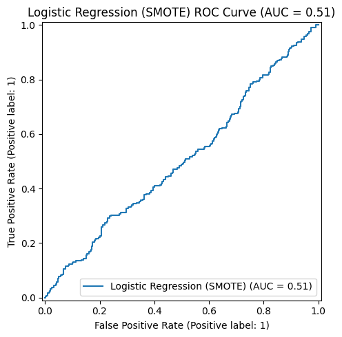
Figure 9: ROC curve for the SMOTE-enhanced Logistic Regression model (AUC = 0.51)
 Although class balancing enabled the model to produce non-trivial positive predictions, the ROC curve shows that its ability to distinguish potable vs. non-potable water remains only slightly better than random guessing.

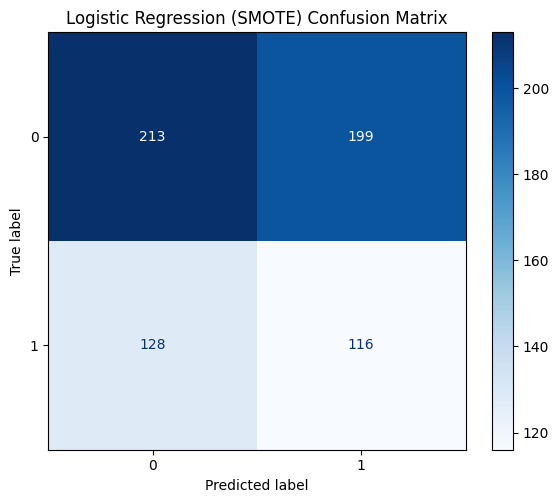
Figure 10: Confusion matrix for Logistic Regression after applying SMOTE
 Balancing the training data allowed the model to correctly identify some potable-water samples (true positives = 116), which the original model failed to detect. However, the model still misclassified many non-potable samples as potable (false positives = 199), indicating a trade-off introduced by oversampling.

#### Neural Network Classifier using SMOTE
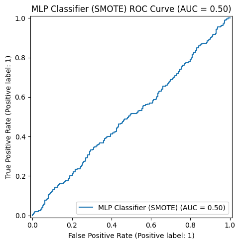
Figure 11: ROC curve for the SMOTE‑enhanced MLPClassifier, showing an AUC of 0.50 
 An AUC at or near 0.50 signals performance close to random guessing, highlighting that this neural network model did not effectively discriminate between potable and non‑potable water samples even after addressing class imbalance.

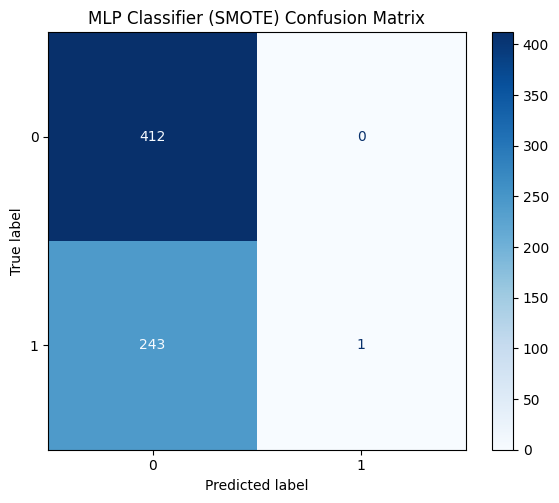
Figure 12: Confusion matrix for the MLPClassifier after SMOTE resampling
 Even with class balancing, the model predicted virtually no potable samples: only 1 true positive and 0 false positives, while misclassifying almost all actual potable samples as non‑potable (243 false negatives). This indicates extremely low sensitivity to the minority class, despite the oversampling step.

#### Decision Tree using SMOTE
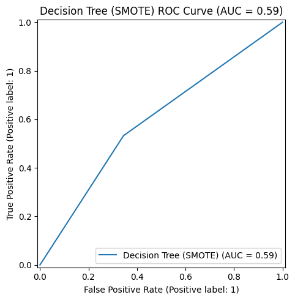
Figure 13: ROC curve for the Decision Tree classifier with SMOTE (AUC = 0.59)
 The curve shows moderate discriminatory ability, outperforming the logistic and MLP models. An AUC of 0.59 indicates the model is better than random guessing and is the strongest performer among the tested models in distinguishing potable from non-potable samples after class balancing.

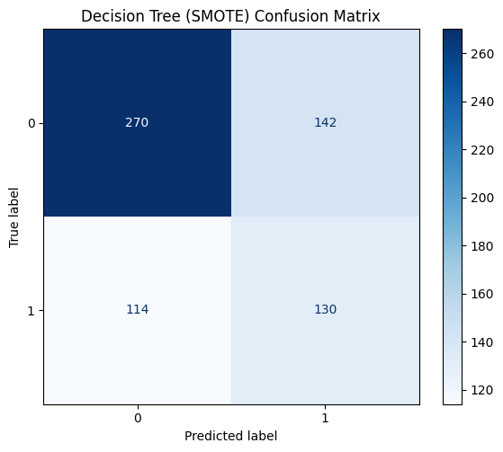
Figure 14: Confusion matrix for the Decision Tree classifier trained on SMOTE-balanced data
 This model successfully identifies both potable (1) and non-potable (0) water samples, with a noticeably better balance between true positives and true negatives compared to the logistic regression and MLP models. The model correctly classified 270 non-potable and 130 potable samples, demonstrating improved sensitivity toward the minority class.

### Comparing Models
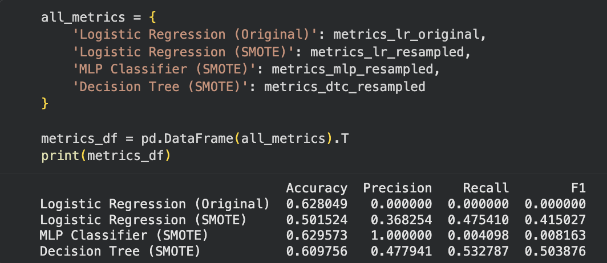
Figure 15: This table compares the performance of all four models tested—Logistic Regression (original), Logistic Regression with SMOTE, MLP Classifier with SMOTE, and Decision Tree with SMOTE—using key classification metrics. Each metric highlights a different aspect of performance, especially important for this imbalanced dataset
  The metric comparison table highlights how different models performed on the imbalanced water potability classification task. The original Logistic Regression model completely failed to identify any potable water samples, as shown by its zero Precision, Recall, and F1-score for the positive class. After applying SMOTE, Logistic Regression improved substantially on the minority class, though its overall accuracy dropped, reflecting the trade-off between detecting positives and misclassifying some negatives. The MLP Classifier achieved the highest accuracy overall, but its extremely low Recall and F1-score indicate that it predicted almost no potable samples, making it ineffective for real-world use. In contrast, the Decision Tree with SMOTE provided the best balance across metrics, achieving the highest F1-score for the potable class and demonstrating the strongest ability to correctly identify positive cases. This indicates that tree-based methods handle the dataset’s nonlinearity and class imbalance more effectively than logistic regression or neural networks in this context.

## Conlusion
The model that performed the best based on the metrics_df and the generated Confusion Matrices and ROC Curves, we can analyze the performance of each model:

* Logistic Regression (Original): Achieved an Accuracy of 0.628, but its Precision, Recall, and F1-score for the positive class (potable water) were 0.0. This indicates that the model completely failed to identify any positive samples, predicting only the majority class (non-potable water). This is a common issue with highly imbalanced datasets when no specific handling is applied.

* Logistic Regression (SMOTE): After applying SMOTE to balance the training data, the Logistic Regression model showed significantly improved performance on the minority class. While its Accuracy dropped to 0.501, its Precision (0.368), Recall (0.475), and F1-score (0.415) for the positive class are now non-zero, indicating it can identify some potable water samples. This model attempts to balance false positives and false negatives for the minority class.

* MLP Classifier (SMOTE): This model achieved an Accuracy of 0.629. Interestingly, its Precision is 1.0, but its Recall is extremely low (0.004), leading to a very low F1-score (0.008). This suggests that while the few positive predictions it made were correct (high precision), it missed almost all actual positive cases (very low recall). This behavior might indicate overfitting to the synthetic samples or that the MLP, despite SMOTE, struggled to learn the complex patterns of the minority class, defaulting to predicting the majority class with high confidence for the few positive predictions it made.

* Decision Tree (SMOTE): The Decision Tree Classifier with SMOTE achieved an Accuracy of 0.609. Its Precision (0.478), Recall (0.533), and F1-score (0.504) for the positive class are the highest among the models that attempted to predict the minority class. This suggests it provides the best balance between identifying positive cases and minimizing false positives, making it the best-performing model in terms of handling the imbalanced dataset and effectively identifying potable water.

Overall, the Decision Tree Classifier (SMOTE) performed best in terms of a balanced F1-score, which is crucial for imbalanced classification problems where correctly identifying the minority class is important.

The neural network (MLPClassifier) did not improve performance significantly, especially when considering the F1-score for the minority class. While its overall Accuracy (0.629) was similar to the original Logistic Regression, its Recall for the positive class was extremely poor (0.004), indicating it barely identified any actual potable water samples. Its high Precision (1.0) with low Recall is often a sign of a model being overly cautious and making very few positive predictions, leading to an effectively conservative model that does not address the class imbalance well.

This outcome aligns with the professor's hint about a more flexible model not always improving performance. The MLPClassifier, being more complex, might have overfit to the noise or the synthetic samples generated by SMOTE, or simply struggled to generalize well on the true positive instances in the test set. In classification tasks with severe imbalance, a simple increase in model complexity doesn't always translate to better minority class performance without careful tuning and architectural considerations.

The models used (Logistic Regression, MLP, Decision Tree) don't directly provide feature importances in the same intuitive way. However, we can infer some insights:

* Correlation Heatmap (from EDA): The initial EDA showed relatively low correlations between individual features and Potability, suggesting that no single feature is a dominant predictor. This implies that potability is likely determined by a complex interaction of multiple water quality parameters.
* Decision Tree (from its nature): Decision Trees intrinsically identify features that are most effective at splitting the data. If we were to inspect the trained dtc_resampled model, the features used at the top nodes of the tree would be considered the most important for its classifications. Without explicitly extracting feature importances, we can say that the Decision Tree model managed to find a combination of features that discriminates between potable and non-potable water better than the other models, suggesting that its ability to capture non-linear relationships and interactions was beneficial.
Further analysis, such as permutation importance or SHAP values, would be needed to definitively identify the most important features across all models.

Limitations
1. Imbalanced Classes: This was a primary limitation identified early in the EDA. The original Logistic Regression model completely failed to predict the minority class. While SMOTE helped, balancing synthetic data can sometimes introduce noise or make the decision boundary less clear, potentially leading to a decrease in overall accuracy for the majority class, as seen with Logistic Regression (SMOTE).
2. Missing Values: The dataset had missing values for 'ph', 'Sulfate', and 'Trihalomethanes'. Imputing with the median is a simple approach, but it might not be the most accurate, especially if the missingness is not random. More sophisticated imputation techniques (e.g., K-Nearest Neighbors imputation) could potentially yield better results.
3. Model Complexity vs. Performance: The MLPClassifier, a more complex model, did not outperform the simpler Decision Tree or even the SMOTE-enhanced Logistic Regression in terms of balanced F1-score for the minority class. This highlights that model complexity does not guarantee better performance, especially when dealing with data challenges like imbalance or if the underlying relationships are not highly complex.
4. Limited Data Exploration: While an initial EDA was performed, a deeper dive into feature engineering, interaction terms, or outlier treatment could potentially improve model performance.
Real-world interpretation
Based on these models, predicting water potability is a challenging task due to the subtle differences between potable and non-potable water, as indicated by the overlapping feature distributions and low individual feature correlations with the target variable. The Decision Tree Classifier with SMOTE is the most promising model here because it was able to correctly identify potable water samples with a reasonable balance of precision and recall.

In a real-world scenario, the consequences of misclassifying non-potable water as potable (false positive) are severe, as it could lead to health risks. Conversely, classifying potable water as non-potable (false negative) could lead to unnecessary treatment or resource waste. Therefore, prioritizing Recall (minimizing false negatives) or a high F1-score (balancing precision and recall) for the positive class (potable water) would be critical. Our best model (Decision Tree) shows a reasonable F1-score of 0.504 for the minority class.

To deploy such a system, continuous monitoring of water quality parameters and regular recalibration of the model would be essential. Furthermore, the model's predictions should be seen as a strong indicator for further human inspection and laboratory testing, rather than a definitive final decision, given the critical nature of water potability.

### Overall + What's Next
The original dataset presented a significant class imbalance, with the majority of water samples being non-potable.
Without handling class imbalance, the initial Logistic Regression model completely failed to predict the minority class (potable water), showing 0.0 for Precision, Recall, and F1-score.
Applying SMOTE to the training data successfully balanced the classes, enabling subsequent models to predict the minority class.
Logistic Regression improved significantly after SMOTE, achieving a minority class F1-score of 0.415 (Precision: 0.368, Recall: 0.475), despite a decrease in overall accuracy to 0.501.
The MLP Classifier with SMOTE showed an overall accuracy of 0.629 but struggled severely with the minority class, exhibiting a Precision of 1.0, an extremely low Recall of 0.004, and an F1-score of 0.008, indicating it missed most actual positive cases.
The Decision Tree Classifier with SMOTE yielded the best-balanced performance for the minority class, with an F1-score of 0.504 (Precision: 0.478, Recall: 0.533) and an overall accuracy of 0.609.
The critical importance of addressing class imbalance in datasets, as demonstrated by the stark performance difference between the original and SMOTE-enhanced Logistic Regression models.
Further investigation into advanced feature engineering techniques, more sophisticated imputation methods, or ensemble models could potentially improve overall model performance and minority class prediction.

## References
Kadiwal, A. (2021). Water Potability Dataset [Data set]. Kaggle. https://www.kaggle.com/datasets/adityakadiwal/water-potability

## Code
https://github.com/aryank52-afk/aryank52-afk.github.io/blob/67059bfe4f54bc7866b3600f7289bc4e41cd793d/assets/C111_Final_Project_Finished.ipynb
